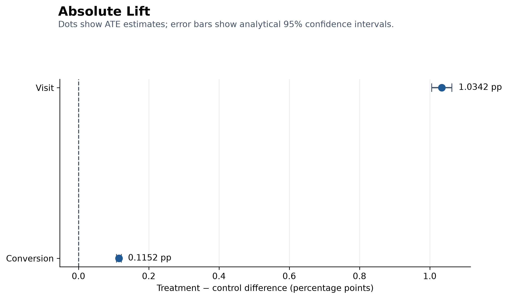
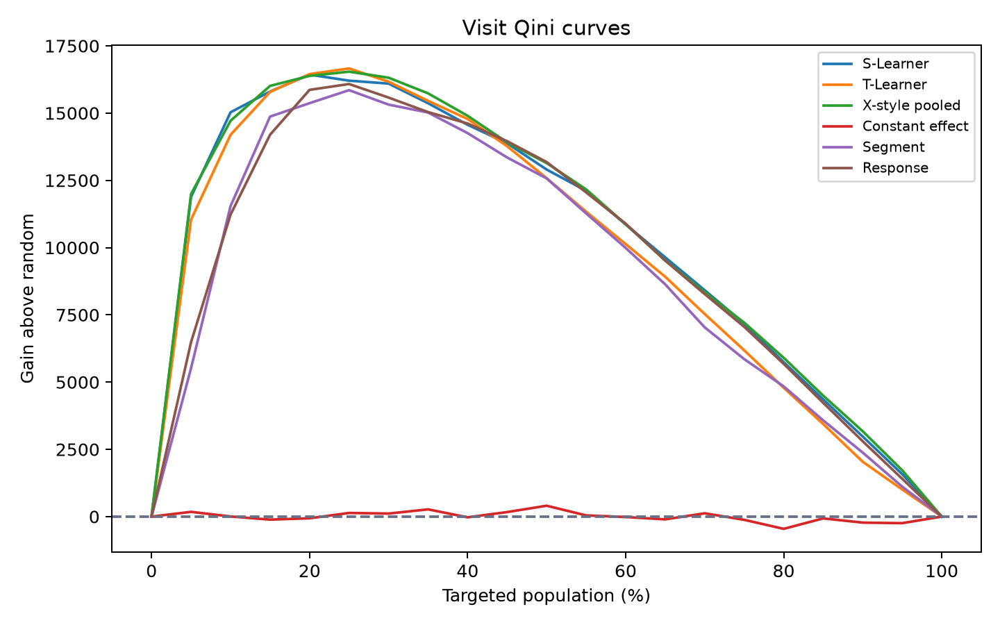
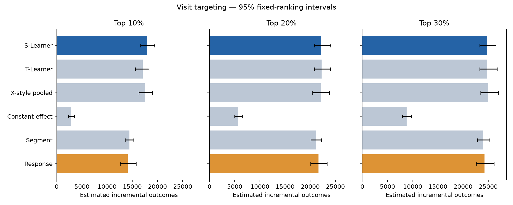
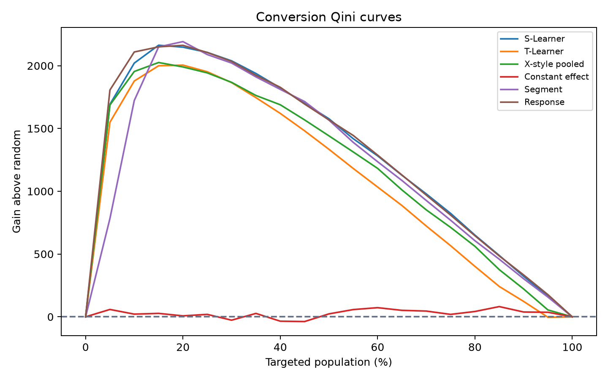
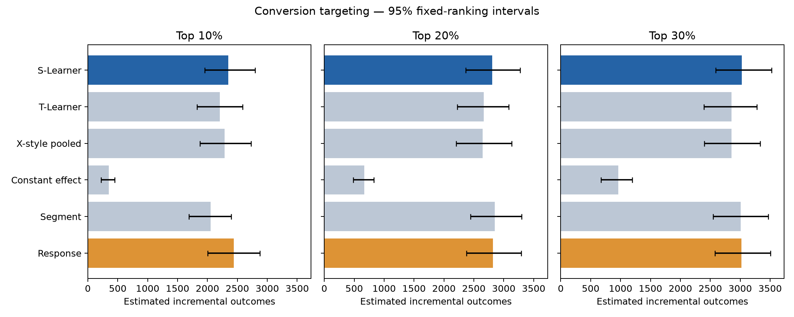

# AdLift: Advertising Incrementality and Uplift Targeting

## Executive summary

Randomized advertising eligibility increased visits and conversions in Criteo's released uplift benchmark. Treatment raised visits from 3.820% to 4.854% (absolute lift 1.034 percentage points; 95% CI 1.006–1.063) and conversions from 0.194% to 0.309% (absolute lift 0.115 percentage points; 95% CI 0.108–0.122).

Individual targeting results differ by objective. For visits, the S-Learner has Qini 10,550 and exceeds response targeting by 645 (2,000-draw fixed-ranking 95% interval 413–883). At a 10% targeting budget, it estimates 17,919 incremental visits, 3,805 more than response ranking (95% interval 2,804–4,829). For conversions, response propensity remains the supported choice: S-Learner's Qini is 9.99 lower (95% interval -18.78 to -0.99), and its disadvantage is clearest at 5–10% targeting.

These are exploratory benchmark findings. The evaluation specification was expanded after an initial look at test results. A future deployment decision needs a prospectively frozen rule and fresh sample or online experiment.

## Business question

Response targeting asks who is likely to act. Uplift targeting asks whose behavior advertising is likely to change. AdLift tests whether this causal ranking can allocate a limited advertising budget more effectively than random or high-response targeting.

## Data and experimental setup

The analysis uses 13,979,592 rows from the public Criteo uplift release, including twelve anonymized features, treatment assignment, exposure, visit, and conversion. The release combines randomized incrementality tests. Treatment is the causal assignment; exposure is a post-assignment delivery measure and does not define the primary groups.

All released rows are retained. The modeling split uses a seeded feature-vector hash so identical feature profiles cannot cross train, validation, and test. The final test population contains 2,795,749 rows: 2,376,531 treatment and 419,218 control.

## Average incrementality

| Outcome | Control | Treatment | Absolute lift | Relative lift | Incremental outcomes among treated |
|---|---:|---:|---:|---:|---:|
| Visit | 3.820% | 4.854% | 1.034 pp | 27.07% | 122,895 |
| Conversion | 0.194% | 0.309% | 0.115 pp | 59.45% | 13,687 |

Both assignment effects are statistically precise in the released sample. Incremental counts are model-based aggregate estimates, since no individual's untreated and treated outcomes are jointly observable.

## Uplift models and evaluation

The study compares an S-Learner, T-Learner, and pooled X-style learner using LightGBM. It also evaluates constant-effect, validation-selected segment, response-propensity, and random baselines. Test outcomes remain hidden in score artifacts and are joined only for evaluation.

Models are judged by cumulative gain and Qini rather than ordinary prediction metrics. The fixed-ranking paired bootstrap preserves comparisons among rankings but does not include training or model-selection uncertainty.

## Targeting results

The tables below put every reported targeting fraction on one decision scale. Selected-group
uplift is the treatment-minus-control outcome-rate difference within the selected records.
Cumulative incremental outcomes equal selected records multiplied by that difference. Uplift
captured divides cumulative gain by the common 100% endpoint. Gain above random subtracts the gain
expected from selecting the same population fraction without a ranking. These are test-set estimates
for the released benchmark; no cost, revenue, or ROI fields are available.

### Visit policy: S-Learner ranking

| Target | Selected records | Selected-group uplift | Cumulative incremental visits | Uplift captured | Gain above random |
|---:|---:|---:|---:|---:|---:|
| 5% | 139,788 | 9.535 pp | 13,329 | 46.1% | 11,884 |
| 10% | 279,575 | 6.409 pp | 17,919 | 62.0% | 15,030 |
| 20% | 559,150 | 3.972 pp | 22,208 | 76.9% | 16,429 |
| 30% | 838,725 | 2.953 pp | 24,765 | 85.7% | 16,097 |
| 40% | 1,118,300 | 2.336 pp | 26,123 | 90.4% | 14,565 |
| 50% | 1,397,875 | 1.956 pp | 27,349 | 94.7% | 12,902 |
| 75% | 2,096,812 | 1.376 pp | 28,846 | 99.8% | 7,176 |
| 100% | 2,795,749 | 1.033 pp | 28,893 | 100.0% | 0 |

For a constrained Visit budget, the ranking concentrates a large share of the estimated total
incrementality: the top 10% captures 62.0% of the test-set endpoint. Expanding from 10% to 30%
increases total estimated visits but lowers incremental yield per selected record.

### Conversion policy: response-propensity ranking

| Target | Selected records | Selected-group uplift | Cumulative incremental conversions | Uplift captured | Gain above random |
|---:|---:|---:|---:|---:|---:|
| 5% | 139,788 | 1.410 pp | 1,972 | 59.8% | 1,807 |
| 10% | 279,575 | 0.872 pp | 2,439 | 74.0% | 2,109 |
| 20% | 559,150 | 0.505 pp | 2,822 | 85.6% | 2,162 |
| 30% | 838,725 | 0.360 pp | 3,023 | 91.7% | 2,034 |
| 40% | 1,118,300 | 0.281 pp | 3,147 | 95.5% | 1,828 |
| 50% | 1,397,875 | 0.230 pp | 3,217 | 97.6% | 1,569 |
| 75% | 2,096,812 | 0.157 pp | 3,283 | 99.6% | 810 |
| 100% | 2,795,749 | 0.118 pp | 3,296 | 100.0% | 0 |

Response propensity is shown because it is the supported Conversion ranking. The concentration of
incremental conversions in its highest-response records does not establish that an uplift learner
improves Conversion targeting.

### Does uplift ranking beat response targeting at the main budgets?

| Outcome | Uplift learner | Target | Gain difference vs response | Paired 95% interval | Interpretation |
|---|---|---:|---:|---:|---|
| Visit | S-Learner | 5% | +5,400 visits | 4,400 to 6,452 | Clear uplift-ranking advantage |
| Visit | S-Learner | 10% | +3,805 visits | 2,804 to 4,829 | Clear uplift-ranking advantage |
| Visit | S-Learner | 20% | +566 visits | -104 to 1,281 | Difference unresolved |
| Visit | S-Learner | 30% | +521 visits | 46 to 1,029 | Positive but marginal |
| Conversion | S-Learner | 5% | -114 conversions | -186 to -37 | Response ranking is better |
| Conversion | S-Learner | 10% | -89 conversions | -147 to -31 | Response ranking is better |
| Conversion | S-Learner | 20% | -15 conversions | -56 to 28 | Difference unresolved |
| Conversion | S-Learner | 30% | +4 conversions | -16 to 27 | Difference unresolved |

These paired intervals come from the retained 2,000-draw fixed-ranking sensitivity audit. The 5%
comparison was added after the initial test review, and all budget comparisons remain exploratory.

### Visits

X-style pooling has the highest point Qini, but its paired difference from the simpler S-Learner is unresolved, so the historical rule chooses S-Learner. S-Learner's global Qini exceeds response targeting. Its clearest advantage occurs at tighter budgets: 5,400 additional visits over response at 5%, and 3,805 at 10%. The 20% difference includes zero; the 30% difference is positive but marginal in the 2,000-draw sensitivity check.

### Conversions

S-Learner leads the uplift learners but does not beat response propensity. It performs worse than response ranking at 5% and 10%, and differences at 20% and 30% are unresolved. Response propensity is therefore the supported conversion ranking under this exploratory evaluation.

### Cross-objective policies

Visit and conversion S-Learner scores have Spearman rank correlation 0.888. At 30%, the policies share 84.7% of selected records. This is high agreement, but the policy differences can still matter for rare conversions; objective-specific evaluation should be retained.

## Recommendation

If the operational goal is visits and the budget targets a small fraction of the population, advance the S-Learner ranking to prospective validation. If the goal is conversions, retain response propensity as the benchmark challenger. Do not claim that 30% is an optimal spend level: it is only the volume-maximizing result among three tested candidate fractions under no cost or revenue model.

Before deployment, freeze one learner, threshold, primary metric, and uncertainty procedure; evaluate once on untouched data or in an online randomized policy test; and add cost or value per action to choose an economically meaningful threshold.

## Limitations

- Criteo non-uniformly subsampled and anonymized the public release; results do not recover an advertiser's original incrementality.
- No campaign, timestamp, cost, revenue, or identifiable user fields support campaign, temporal, profit, or cluster-aware analysis.
- The historical `x_learner` is a pooled X-style variant rather than the canonical two-regressor, propensity-blended X-Learner.
- Only one alternate training seed was saved; model stability evidence is limited.
- Bootstrap intervals condition on trained models and fixed ranking bins.
- Evaluation rules were expanded after initial test inspection, so confirmation requires new data.

The complete numerical and methodological audit is in the [evaluation audit](audit/evaluation_audit.md).

## Conclusion

The randomized experiment shows that advertising creates measurable incremental value, increasing Visit rate by 1.034 percentage points and Conversion rate by 0.115 percentage points. The targeting analysis further demonstrates that this value can be allocated more efficiently when the business objective is Visit growth: targeting the top 10% of records ranked by the S-Learner captures 62.0% of the estimated full-population incremental visits, generating approximately 17,919 incremental visits and 3,805 more than conventional response targeting while serving only 10% of the population. This indicates a meaningful opportunity to reduce unnecessary advertising exposure or concentrate a limited budget on users whose behavior is more likely to change. The same conclusion does not extend to Conversion, where the tested uplift learners fail to outperform response propensity and perform significantly worse at the tightest budgets. The recommended strategy is therefore objective-specific: advance the S-Learner to prospective validation for Visit-focused campaigns, while retaining response propensity as the Conversion benchmark.
